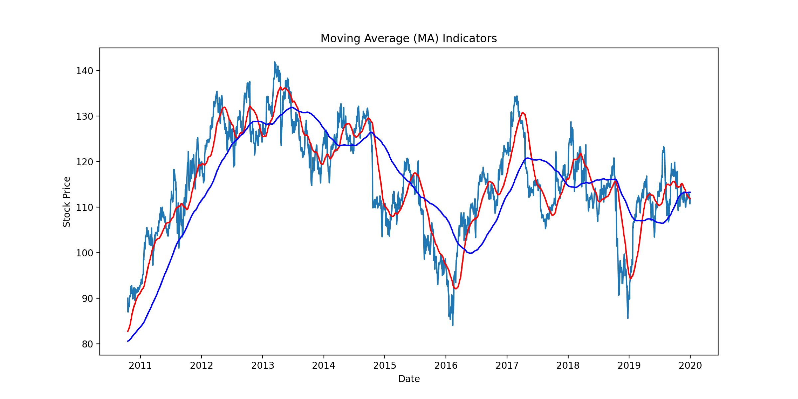
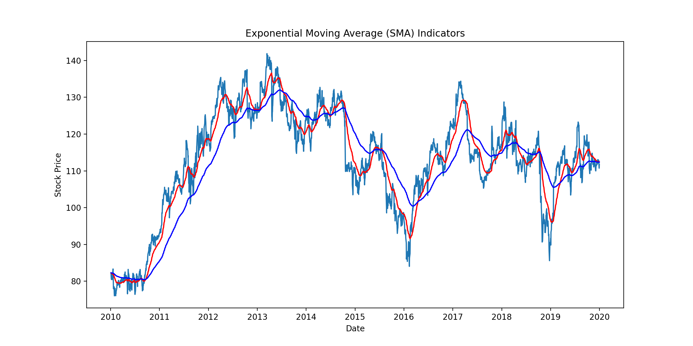
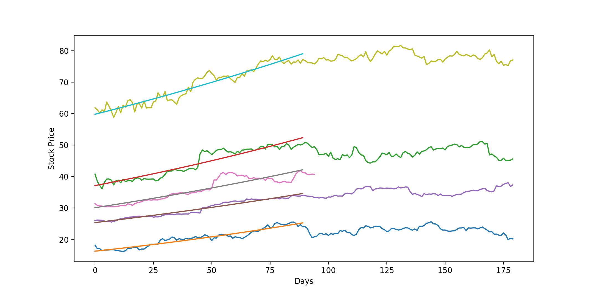

# Algorithmic_Trading_Udemy

This repository contains course materials from Udemy Algorithmic Trading Course. 

## Code for some topics in quantitative finance  

### 1. Moving Average Indicator
[SMAExample.py](https://github.com/weimufeng/Algorithmic_Trading_Udemy/blob/main/PythonCode/SMAExample.py)  
[EMAExample.py](https://github.com/weimufeng/Algorithmic_Trading_Udemy/blob/main/PythonCode/EMAExample.py)

Strategy Implementation  
[SMACrossover.py](https://github.com/weimufeng/Algorithmic_Trading_Udemy/blob/main/PythonCode/SMACrossover.py)
#### Sample:  

### 2. Relative Strength Indicator
[RSI.py](https://github.com/weimufeng/Algorithmic_Trading_Udemy/blob/main/PythonCode/RSI.py)  
[RSITrading.py](https://github.com/weimufeng/Algorithmic_Trading_Udemy/blob/main/PythonCode/RSITrading.py)  

### 3. Backtrader module  
[BacktraderExample.py](https://github.com/weimufeng/Algorithmic_Trading_Udemy/blob/main/PythonCode/BacktraderExample.py)

### 4. Average True Range Indicator  
[ATRImplementation.py](https://github.com/weimufeng/Algorithmic_Trading_Udemy/blob/main/PythonCode/ATRImplementation.py)

### 5. Momentum & SMA Combined Trading Strategy  
[RegressionMomentum.py](https://github.com/weimufeng/Algorithmic_Trading_Udemy/blob/main/PythonCode/RegressionMomentum.py)  
#### Sample:
  

Implementation of a combined momentum and SMA strategy using backtrader module.  
[MomentumStrategy.py](https://github.com/weimufeng/Algorithmic_Trading_Udemy/blob/main/PythonCode/MomentumStrategy.py)  

### 6. Autoregressive Model (AR)  
[AR](https://github.com/weimufeng/Algorithmic_Trading_Udemy/tree/main/TimeSeries/AR)  

### 7. Moving Average Model (MA)  
[MA](https://github.com/weimufeng/Algorithmic_Trading_Udemy/tree/main/TimeSeries/MA)  

### 8. Autoregressive Moving Average Model (ARMA)  
[ARMA](https://github.com/weimufeng/Algorithmic_Trading_Udemy/tree/main/TimeSeries/ARMA)  

### 9. Autoregressive Conditional Heteroskedastic Model (ARCH) and Generalized Autoregressive Conditional Heteroskedastic Model (GARCH)  
[GARCH](https://github.com/weimufeng/Algorithmic_Trading_Udemy/tree/main/TimeSeries/HeteroskedasticityModels)

### 10. Strategy: ARIMA and GORCH Implementation on FOREX and Stocks
[TradingStrategy](https://github.com/weimufeng/Algorithmic_Trading_Udemy/tree/main/TimeSeries/TradingStrategy)

### 11. Strategy: Bollinger Bands  
[BollingerBandsTradingStrategy.py](https://github.com/weimufeng/Algorithmic_Trading_Udemy/blob/main/PythonCode/BollingerBandsTradingStrategy.py)

### 12. Strategy: Cross-Sectional Mean Reversion  
[CrossSectionalMeanReversion.py](https://github.com/weimufeng/Algorithmic_Trading_Udemy/blob/main/PythonCode/CrossSectionalMeanReversion.py)

